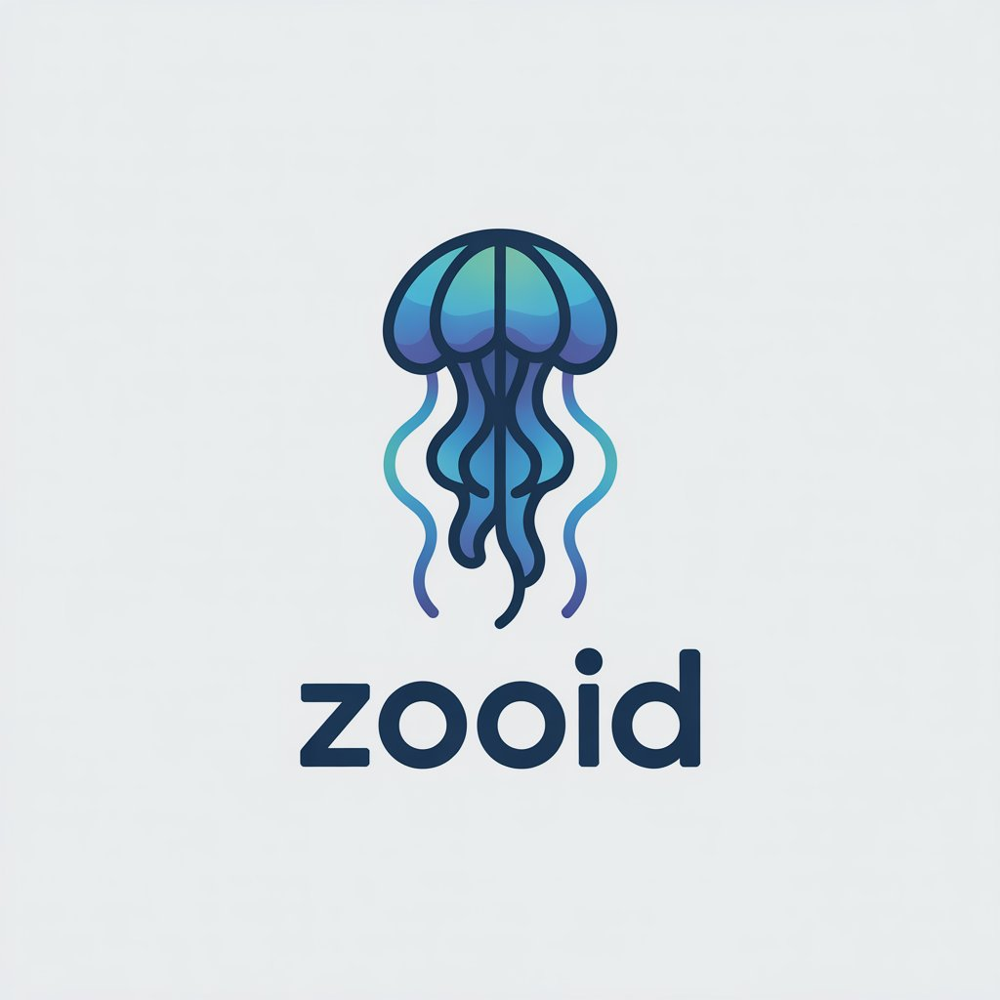

<p align="center">
  
</p>

<p align="center">
  <b>A multi-tenant Nostr relay for communities.</b>
</p>

<p align="center">
  <a href="#quick-start">Quick start</a> ·
  <a href="#configuration">Configuration</a> ·
  <a href="#api">API</a>
</p>

---

Zooid is a multi-tenant relay built on [Khatru](https://gitworkshop.dev/fiatjaf.com/nostrlib/tree/master/khatru) with a flexible set of access controls. It's designed to pair with [Flotilla](https://flotilla.social) as a community relay (with full NIP 29 support), but it works just fine outside of a community context too.

## Features

- **Multi-tenant** — run any number of virtual relays from a single instance, each with its own host, schema, and policy.
- **Community-ready** — first-class support for [NIP 29](https://github.com/nostr-protocol/nips/blob/master/29.md) groups, invite codes, and role-based access.
- **Batteries included** — optional [Blossom](https://github.com/hzrd149/blossom) media, [NIP 86](https://github.com/nostr-protocol/nips/blob/master/86.md) management, [NIP 9a](https://github.com/nostr-protocol/nips/pull/1079) push, and [LiveKit](https://livekit.io/) audio/video calls.
- **Remotely manageable** — JSON REST API authenticated via [NIP 98](https://github.com/nostr-protocol/nips/blob/master/98.md).
- **Operationally simple** — single binary, SQLite storage, OCI container, optional pprof.

## Quick start

```sh
docker run -it \
  -p 3334:3334 \
  -v ./config:/app/config \
  -v ./media:/app/media \
  -v ./data:/app/data \
  gitea.coracle.social/coracle/zooid
```

Drop a TOML config file into `./config/` (see [Configuration](#configuration)) and the relay will be available at `ws://<host>:3334`.

## Architecture

A single zooid instance can run any number of "virtual" relays. The `config` directory can contain any number of configuration files, each of which represents a single virtual relay.

## Environment

Zooid supports a few environment variables, which configure shared resources like the web server or sqlite database.

- `PORT` - the port the server will listen on for all requests. Defaults to `3334`.
- `CONFIG` - where to store relay configuration files. Defaults to `./config`.
- `MEDIA` - where to store blossom media files. Defaults to `./media`.
- `DATA` - where to store database files. Defaults to `./data`.
- `API_HOST` - the hostname on which to expose the management API. If not set, the API is disabled.
- `API_WHITELIST` - a comma-separated list of nostr hex pubkeys authorized to use the management API.
- `PPROF_ADDR` - an http host to serve pprof stats on.

## Configuration

Configuration files are written using [toml](https://toml.io). Top level configuration options are required:

- `host` - a hostname to serve this relay on. Must match the `Host` header sent by the client, including the port if the client connects on a non-standard port (e.g. `relay.example.com:8443`). When running behind a reverse proxy such as nginx, ensure the proxy forwards the original `Host` header unmodified; with nginx, use `proxy_set_header Host $http_host;` (the common `$host` variable drops the port).
- `schema` - a string that identifies this relay. This cannot be changed, and must be usable as a sqlite identifier.
- `secret` - the nostr secret key of the relay. Will be used to populate the relay's NIP 11 `self` field and sign generated events.
- `inactive` - a boolean indicating whether the relay is currently inactive. The relay will not be available if set.

### `[info]`

Contains information for populating the relay's `nip11` document.

- `name` - the name of your relay.
- `icon` - an icon for your relay.
- `pubkey` - the public key of the relay owner. Does not affect access controls.
- `description` - your relay's description.

### `[policy]`

Contains policy and access related configuration.

- `public_join` - whether to allow non-members to join the relay without an invite code. Defaults to `false`.
- `strip_signatures` - whether to remove signatures when serving events to non-admins. This requires clients/users to trust the relay to properly authenticate signatures. Be cautious about using this; a malicious relay will be able to execute all kinds of attacks, including potentially serving events unrelated to a community use case.

### `[groups]`

Configures NIP 29 support.

- `enabled` - whether NIP 29 is enabled.

### `[management]`

Configures NIP 86 support.

- `enabled` - whether NIP 86 is enabled.

### `[blossom]`

Configures blossom support.

- `enabled` - whether blossom is enabled.
- `authenticated_read` - whether users must perform NIP 98 AUTH in order to fetch a file.
- `adapter` - where to store blobs. Either `local` (the default, stores files under `MEDIA`) or `s3` (stores files in an S3-compatible bucket).

#### `[blossom.s3]`

Configures S3-compatible object storage, used when `blossom.adapter` is `s3`.

- `endpoint` - the S3 endpoint URL. Optional; leave unset to use AWS S3.
- `region` - the bucket region. Required when `adapter` is `s3`.
- `bucket` - the bucket name. Required when `adapter` is `s3`.
- `access_key` - the access key ID. Required when `adapter` is `s3`.
- `secret_key` - the secret access key. Required when `adapter` is `s3`.
- `key_prefix` - an optional prefix prepended to every object key.

### `[push]`

Configures NIP 9a push support.

- `enabled` - whether push is enabled.

### `[roles]`

Defines roles that can be assigned to different users and attendant privileges. Each role is defined by a `[roles.{role_name}]` header and has the following options:

- `pubkeys` - a list of nostr pubkeys this role is assigned to.
- `can_invite` - a boolean indicating whether this role can invite new members to the relay by requesting a `kind 28935` claim. Defaults to `false`. See [access requests](https://github.com/nostr-protocol/nips/pull/1079) for more details.
- `can_manage` - a boolean indicating whether this role can use NIP 86 relay management and administer NIP 29 groups. Defaults to `false`.

A special `[roles.member]` heading may be used to configure policies for all relay users (that is, pubkeys assigned to other roles, or who have redeemed an invite code).

### `[livekit]`

[Livekit](https://livekit.io/) is an open source WebSockets toolkit for audio and video calls. Configuring a livekit server allows clients to start audio and video calls.

- `server_url` - the URL to your Livekit server.
- `api_key` - a key identifying this relay, assigned by the Livekit server.
- `api_secret` - a secret key authenticating this relay, assigned by the Livekit server.

On your LiveKit server you should also set up a webhook so LiveKit can notify the relay when people join or leave rooms; the relay uses these notifications to publish a kind 39004 presence event. How you point the webhook depends on how many relays share a LiveKit project:

- **One relay, or a dedicated LiveKit project per relay** — point the webhook at that relay's own `https://yourrelay.com/.well-known/nip29/livekit/webhook`.
- **Several relays sharing one LiveKit project** — point the webhook at the management API's `https://api.relayplatform.com/.well-known/nip29/livekit/webhook` instead. zooid stamps each room's metadata with the owning relay's `schema` when it creates the room, so this shared endpoint routes every event to the relay that owns the room. This requires `API_HOST` to be set.

Either way the webhook is authenticated by LiveKit's own request signature (signed with the relay's `api_secret`) rather than NIP 98, so the shared endpoint is exempt from the `API_WHITELIST`. Configure LiveKit to sign webhooks with the same `api_key`/`api_secret` the relay uses, or the relay will reject them.

### Example

The below config file might be saved as `./config/my-relay.example.com` in order to route requests from `wss://my-relay.example.com:3334` to this virtual relay.

```toml
host = "my-relay.example.com:3334"
schema = "my_relay"
secret = "<hex private key>"

[info]
name = "My relay"
icon = "https://example.com/icon.png"
pubkey = "<hex public key>"
description = "A community relay for my friends"

[policy]
public_join = true
strip_signatures = false

[groups]
enabled = true

[management]
enabled = true

[blossom]
enabled = false

[push]
enabled = false

[roles.member]
can_invite = true

[roles.admin]
pubkeys = ["d9254d9898fd4728f7e2b32b87520221a50f6b8b97d935d7da2de8923988aa6d"]
can_manage = true
```

## API

When `API_HOST` is configured, a JSON REST API is available for managing virtual relays remotely. All API requests must be authenticated using [NIP 98](https://github.com/nostr-protocol/nips/blob/master/98.md) HTTP AUTH signed by a pubkey listed in `API_WHITELIST`.

The API accepts JSON config objects and stores them as TOML files in the `CONFIG` directory. Configs are validated for required fields (`host`, `schema`, `secret`) and duplicate checking (`schema` and `host` must be unique across all relays).

Endpoints:

- `POST /relay/{id}` - Creates a new virtual relay config. Returns 201 on success, 409 if the id/schema/host already exists, 400 for invalid config.
- `PUT /relay/{id}` - Updates an existing virtual relay config. Returns 200 on success, 404 if the id doesn't exist, 409 if the new schema/host conflicts with another relay.
- `PATCH /relay/{id}` - Partially updates an existing virtual relay config by recursively merging the provided JSON. Returns 200 on success, 404 if the id doesn't exist, 409 if the new schema/host conflicts, 400 for invalid config. Use `null` values to remove fields.
- `DELETE /relay/{id}` - Deletes a virtual relay config. Returns 200 on success, 404 if the id doesn't exist.
- `GET /relay/{id}/members` - Returns relay members as JSON (`{"members": ["<pubkey>", ...]}`). Returns 200 on success, 404 if the relay id does not exist.

## Scripts

After running `just build`, a number of scripts will be available:

- `./bin/export` prints JSONL events to stdout for a given virtual relay
- `./bin/import` takes JSONL events on stdin and imports it into the given virtual relay

## Development

See `justfile` for defined commands.

## License

[MIT](./LICENSE)
